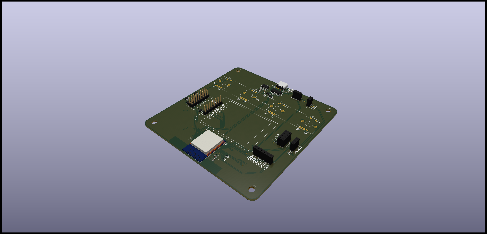
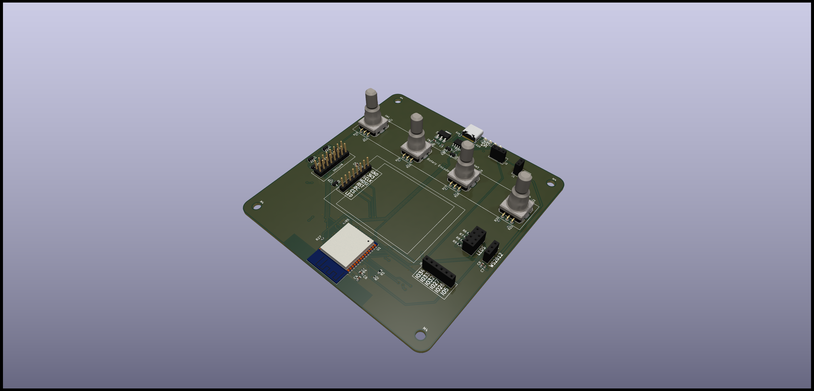
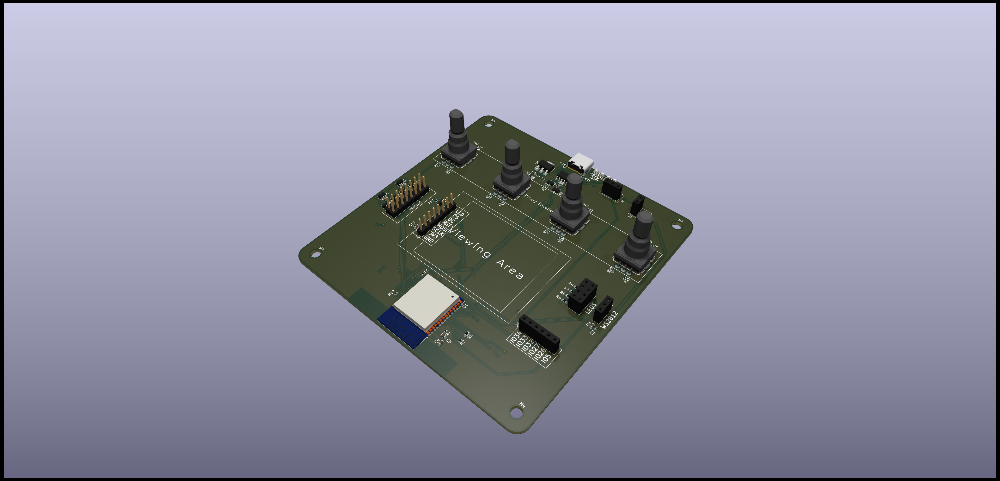
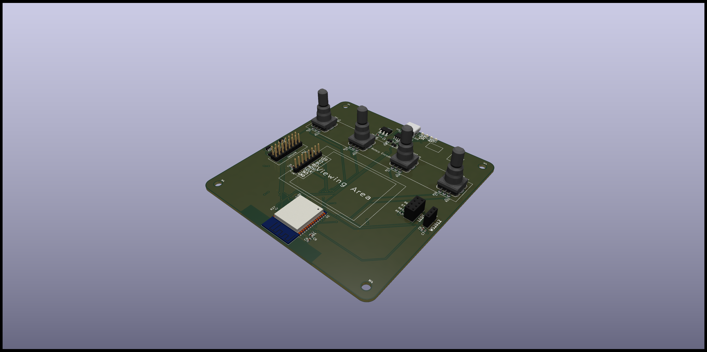

# pcb

## Version 0.1 (Routing complete)

## Version 1.0 (PCB complete)

## Version 1.1 (Fix wrong rotary encoder)

## Version 1.2 (Fix flipped display header)

## Version 2.0 (Actually connect the rotary encoders)

